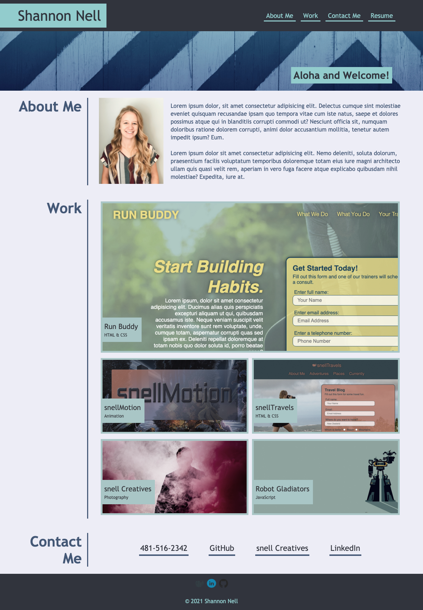

# Challenge 2: Portfolio

## Description
A website to showcase my personal portfolio that can evolve as I progress in my studies. Initial design for the website is based off of a provided mock-up example on the websites appearance and funcitonality.

Used flexboxes to style layout, media queries to ensure responsiveness to multiple screen sizes, and advanced pseudo classes to add depth to the page.

## Table of Contents

* [Usage](#usage)
* [Links](#links)
* [Tools](#tools)
* [Credits](#credits)
* [Challenge Guidelines](#challenge-guidelines)

## Usage
Personal/for potential employers to see work:

## Links

### Deployed Portfolio Website:
* [Nell Portfolio](https://shannonnell.github.io/UoT-coding-challenge2/)
### Links that Helped me along the way:
* [Responsive Image Grid](https://www.w3schools.com/howto/howto_css_image_grid_responsive.asp)
* [Youtube- Flexbox Design Patterns](https://www.youtube.com/watch?v=vQAvjof1oe4) 
* [W3Schools - Opacity with Box](https://www.w3schools.com/howto/tryit.asp?filename=tryhow_css_image_overlay_opacity)
* [Stack Overflow - Desaturating images](https://stackoverflow.com/questions/22994810/how-do-i-desaturate-and-saturate-an-image-using-css) 

## Tools
* HTML
* CSS

## Credits
GitHub: [ShannonNell](https://github.com/ShannonNell)

## Challenge Guidelines
### Task:
Build portfolio of work samples

### Criteria:
- WHEN load portfolio -- THEN see name, photo/avatar, about me section, work section, and contact section
- WHEN click links -- THEN UI scrolls to corresponding section
- WHEN click work -- THEN UI scrolls to section with titled images of developer's apps
- WHEN see first app -- THEN that app's image is larger in size than the others
    - (is this when you click or first impression, this app needs to be the largest on the screen?)
- WHEN click app images -- THEN taken to that deployed app
- WHEN page resized -- THEN responsive layout adapts

### Steps:
- √ Outline HTML
- √ Basic CSS
- √ Flexboxes
- √ Match client portfolio piece (but with my own content)
- √ Text over images
- √ Add links to work projects deployed applications
- √ Media Queries
- √ Hover functionality
- √ Page for Resume
- √ Ensure alt for all images
- √ Ensure links lead to appropriate id/page
- √ Ensure heading tags all in order
- √ Deploy app at live URL 
- Submit
 